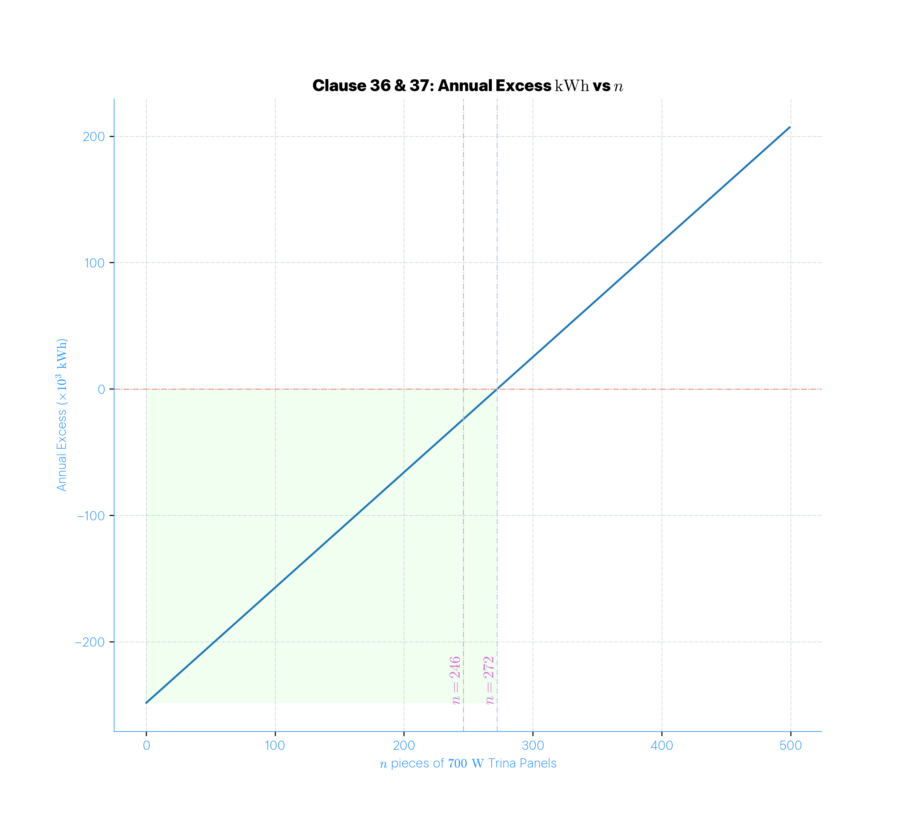

# Solar PV Load Matching & Energy Cost Optimization Algorithm

This repository contains a Python implementation for estimating hourly load profiles, scaling them to match actual consumption, and simulating the integration of a solar PV system to reduce energy costs (net metering). It also computes cashflows, payback periods, NPV, and LCOE for investment decisions.

---

## Table of Contents
1. [Overview](#overview)  
2. [Algorithm Workflow](#algorithm-workflow)  
3. [Mathematical Formulas](#mathematical-formulas)  
4. [Dependencies](#dependencies)  
5. [Usage](#usage)  

---

## Overview

The algorithm performs the following key tasks:

1. Generate an **annual hourly kVA load profile** using random estimates.
2. Separate **active (peak) and off-peak hours** to adjust load scaling.
3. Rescale peak hours to match **actual monthly kWh** consumption.
4. Estimate **hourly solar irradiance** on tilted PV panels using PVLib.
5. Calculate **PV generation** with temperature derating and system losses.
6. Compute **hourly deficits** between PV generation and load.
7. Produce **financial analysis**, including monthly energy cost, savings, cashflows, NPV, and LCOE.

---

## Algorithm Workflow

### 1. Generate Hourly Load Profile

```python
timestamps = pd.date_range(start='2023-01-01', end='2023-12-31 23:00:00', freq='h')
estimated_kVA = timestamps.map(guess_kVA)
annual_kVA = pd.DataFrame({'Time': timestamps, 'Estimated kVA':estimated_kVA}).set_index('Time')
```

- Generate hourly timestamps.
- Use a `guess_kVA` function to populate estimated load.

---

### 2. Separate Peak and Off-Peak Hours

```python
weekdays_kVA = annual_kVA[annual_kVA.index.dayofweek < 5]  # Mon-Fri
active_range_kVA = weekdays_kVA[weekdays_kVA.index.hour.isin(range(6,19))]
non_active_range_kVA = annual_kVA[~annual_kVA.index.isin(active_range_kVA.index)]
```

- Peak hours: 6 AM – 6 PM on weekdays.
- Off-peak hours: all other times.

---

### 3. Scale Peak Hours to Match Actual Monthly kWh

```python
rough_monthly_kWh['k'] = (y - b) / a
```

Where:  
- \(a = 	ext{Hot times kWh}\)  
- \(b = 	ext{Off-peak kWh}\)  
- \(y = 	ext{Actual kWh}\)  

Then, apply the scaling factor \(k\) to hourly peak loads:

```python
active_range_kVA['Actual kVA'] = active_range_kVA['Estimated kVA'] * k
```

---

### 4. Solar Irradiance on Tilted Panels

Using PVLib:

\[
\begin{align*}
I_b &= DNI \cdot \cos(	heta_z) \
I_d &= DHI \cdot \frac{1 + \cos(\beta)}{2} \
I_r &= GHI \cdot 
ho \cdot \frac{1 - \cos(\beta)}{2} \
I_{\text{total}} &= I_b + I_d + I_r
\end{align*}
\]

Where:  
- \(DNI\) = Direct Normal Irradiance  
- \(DHI\) = Diffuse Horizontal Irradiance  
- \(GHI\) = Global Horizontal Irradiance  
- \(\beta_z\) = Solar zenith angle  
- \(\beta\) = Tilt angle of PV panel  
- \(\rho\) = Ground albedo  

---

### 5. PV Generation with Temperature Derating

\[
P_{\text{PV,actual}} = n \cdot A \cdot \eta \cdot I_{\text{total}} \cdot (1 + P_{\text{tderate}} (T_{\text{cell}} - 25)) \cdot \eta_{\text{system}}
\]

Where:  
- \(n\) = Number of panels  
- \(A\) = Panel area  
- \(\eta\) = Panel efficiency  
- \(P_{\text{tderate}}\) = Temperature derating coefficient  
- \(\eta_{\text{system}}\) = Overall system efficiency (inverter, wiring, soiling, other losses)  

---

### 6. Hourly Deficit

\[
\text{Deficit}_t = P_{text{PV,usable},t} - \text{Load}_t
\]

---

### 7. Financial Analysis

#### Energy Costs

- Imported energy cost:

\[
\text{Cost}_{\text{import}} = (\text{Rate} \times text{Consumption}) \times \text{Taxes} + \text{Service Charge}
\]

- Exported energy revenue:

\[
\text{Revenue}_{\text{export}} = (\text{Rate} \times \text{Exported}) \times \text{Taxes} + \text{Service Charge}
\]

#### Net Present Value (NPV)

\[
NPV = \sum_{t=1}^{N} \frac{\text{Savings}_t - \text{O\&M}_t}{(1 + r)^t} - \text{Capital Cost}
\]

#### Levelized Cost of Energy (LCOE)

\[
LCOE = \frac{\text{Total Cost (Capital + O\&M)}}{\sum_{t=1}^{N} \frac{\text{Energy Produced}_t}{(1 + r)^t}}
\]

---

## Dependencies

```text
numpy
pandas
matplotlib
seaborn
scipy
pvlib
numpy-financial
```

---

## Usage

1. Clone the repository:

```bash
git clone https://github.com/yourusername/repo.git
cd repo
```

2. Install dependencies:

```bash
pip install -r requirements.txt
```

3. Run the main notebook or Python script to generate:
   - Hourly load profiles  
   - Solar PV generation  
   - Deficit analysis  
   - Financial cashflows and plots  

---

## Visualization

The repository produces plots for:

- Monthly PV production vs. load  
- Annual cashflows and cumulative cashflows  
- Payback period identification  

Example plot:




---

This README provides a **comprehensive overview** of the methodology, mathematical formulas, and the workflow to reproduce the results.
